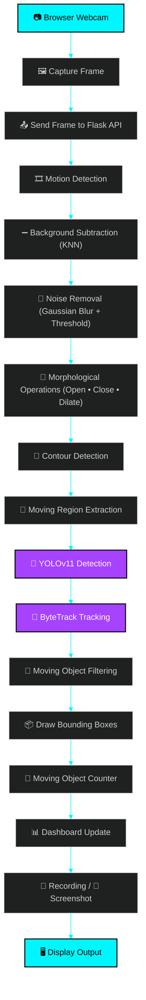
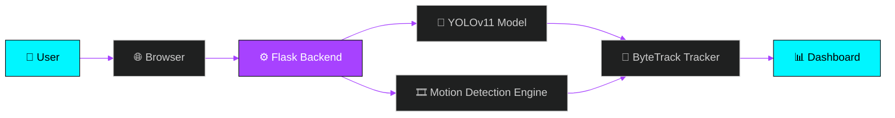

<div align="center">

# 🎯 Live Moving Object Detection System using YOLOv11

### 🧠 Real-Time AI-Powered Motion-Aware Object Detection, Tracking & Analytics Dashboard

<p>
  <em>Detects ONLY what's actually moving — fusing classical Computer Vision with modern Deep Learning.</em>
</p>

[](https://www.python.org/)
[](https://flask.palletsprojects.com/)
[](https://docs.ultralytics.com/)
[](https://opencv.org/)
[](https://railway.app/)
[](#-license)
[](#)

<br/>

```
> ## 🚀 Smart Motion Detection Pipeline
>
> **KNN Motion Detection** → **YOLOv11 Detection** → **ByteTrack Tracking** → **Moving Object Filtering** → **Live Dashboard** → **Recording & Screenshot**
>
> 🎯 **Only moving objects are detected, tracked, counted and logged in real time.**
```

</div>

<br/>

---

## 📡 Live Demo

<div align="center">

> 🚀 **The application is live and deployed on Railway!**

<table>
<tr>
<td align="center">

### 🌐 Click below to open the live dashboard

# [🔗 YOUR_RAILWAY_LINK](YOUR_RAILWAY_LINK)

</td>
</tr>
</table>

</div>

---

## 🎬 Demo Preview

<div align="center">

> 🖼️ **Insert Demo GIF Here**
>
> _(Record a short screen capture of the live dashboard detecting moving objects and drop the GIF/MP4 into this section — e.g. `assets/demo.gif`)_


</div>

---

## ✨ Project Highlights

<table align="center">
<tr>
<td align="center" width="25%">🎯<br/><b>Motion-Only Detection</b><br/><sub>Ignores every static object</sub></td>
<td align="center" width="25%">⚡<br/><b>Real-Time Pipeline</b><br/><sub>Live FPS on every frame</sub></td>
<td align="center" width="25%">🧬<br/><b>Hybrid CV + DL</b><br/><sub>KNN + YOLOv11 + ByteTrack</sub></td>
<td align="center" width="25%">☁️<br/><b>Cloud Native</b><br/><sub>Dockerized & Railway-ready</sub></td>
</tr>
<tr>
<td align="center">🖥️<br/><b>Neon Dashboard</b><br/><sub>Cyberpunk-styled UI</sub></td>
<td align="center">📹<br/><b>Browser Webcam</b><br/><sub>No server camera needed</sub></td>
<td align="center">🧾<br/><b>CSV Logging</b><br/><sub>Every detection recorded</sub></td>
<td align="center">🎞️<br/><b>Record & Screenshot</b><br/><sub>One-click capture</sub></td>
</tr>
</table>

---

## 📖 About The Project

**Live Moving Object Detection System** is a real-time, AI-powered surveillance and analytics tool built with **Python**, **Flask**, **OpenCV**, and **YOLOv11**.

Unlike conventional object detectors that flag *every* object in frame — including parked cars, sitting people, and static furniture — this system applies a **motion-gating layer** on top of YOLOv11 detections. Only objects whose bounding boxes overlap an actively **moving region** (detected via KNN background subtraction) are drawn, counted, tracked, and logged.

> 💡 **In short:** *If it isn't moving, it isn't detected.*

<details>
<summary>🔍 <b>Why motion-filtered detection?</b> (click to expand)</summary>
<br/>

Traditional object detection models report **everything** in the frame — a parked car, a stationary chair, a poster on the wall. In real surveillance and monitoring use cases (intrusion detection, traffic monitoring, wildlife tracking), what matters most is **movement**. This project fuses:

- 🧮 **Classical CV** (background subtraction, morphology, contours) to find *where* motion is happening
- 🧠 **Deep Learning** (YOLOv11 + ByteTrack) to find *what* is in the frame and track it across time
- 🔗 A **gating step** that keeps a detection only if its center lies inside an active motion region

The result: a cleaner, more meaningful detection stream with fewer false positives from static clutter.

</details>

---

## 🧰 Tech Stack

<div align="center">

| Layer | Technology |
|:---|:---|
| 🐍 **Language** | Python 3.11 |
| 🌐 **Backend Framework** | Flask + Gunicorn |
| 🧠 **Object Detection** | YOLOv11 (Ultralytics) |
| 🎯 **Multi-Object Tracking** | ByteTrack |
| 👁️ **Computer Vision** | OpenCV (KNN Background Subtraction, Morphology, Contours) |
| 🔢 **Numerical Computing** | NumPy |
| 🎨 **Frontend** | HTML5, CSS3, Vanilla JavaScript |
| 📷 **Camera Input** | Browser `getUserMedia()` Webcam API |
| 📦 **Containerization** | Docker |
| ☁️ **Cloud Deployment** | Railway |
| 🗂️ **Version Control** | Git & GitHub |

</div>

---

## 🚀 Features

<table align="center">
<tr><td>

✅ Real-Time Moving Object Detection
✅ Motion-Based Filtering (Ignores Static Objects)
✅ YOLOv11 Deep Learning Object Detection
✅ ByteTrack Multi-Object Tracking with Persistent IDs
✅ Live Moving Object Counter
✅ Real-Time FPS Monitoring
✅ Live Detection Status Indicator

</td><td>

✅ Live Recording Status Indicator
✅ One-Click Screenshot Capture
✅ One-Click Video Recording
✅ Downloadable Screenshots
✅ Downloadable Recordings
✅ Auto-Generated CSV Detection Logs
✅ Professional Cyberpunk Neon Dashboard
✅ Browser-Based Webcam (No Server Camera Required)
✅ One-Click Cloud Deployment (Railway + Docker)

</td></tr>
</table>

---

## 🔄 Workflow

### 🌀 Flowchart 1 — Real-Time Detection Pipeline



### 🏗️ Flowchart 2 — System Architecture



---

## 🖼️ Screenshots

<div align="center">

<table>
<tr>
<td align="center" width="50%">
<b>🖥️ Dashboard</b><br/>

</td>
<td align="center" width="50%">
<b>🎯 Detection</b><br/>

</td>
</tr>
<tr>
<td align="center">
<b>🎥 Recording</b><br/>

</td>
<td align="center">
<b>📸 Screenshot Capture</b><br/>

</td>
</tr>
<tr>
<td colspan="2" align="center">
<b>📈 Results / Detection Log</b><br/>

</td>
</tr>
</table>

</div>

---

## 📂 Folder Structure

```
Moving_Object_Detection/
│
├── 🐍 app.py                     # Flask backend + full detection pipeline
├── 📄 requirements.txt           # Python dependencies
├── 🐳 Dockerfile                 # Container build definition
├── ▶️ Procfile                   # Process command for deployment
├── ⚙️ railway.json               # Railway deployment configuration
├── 🐍 runtime.txt                # Python runtime version
├── 🧠 yolo11n.pt                 # YOLOv11 nano pretrained weights
│
├── 📁 templates/
│   └── 🌐 index.html             # Neon dashboard UI
│
├── 📁 static/
│   ├── 🎨 css/
│   │   └── style.css             # Cyberpunk dashboard styling
│   └── ⚡ js/
│       └── script.js             # Webcam capture + dashboard logic
│
├── 📁 output/                    # Saved recordings + detection_log.csv
├── 📁 screenshots/               # Saved screenshots
│
└── 📘 README.md                  # You are here
```

---

## ⚙️ Installation

<details open>
<summary><b>🖥️ Run Locally</b></summary>

<br/>

**1️⃣ Clone the repository**

```bash
git clone https://github.com/your-username/Moving_Object_Detection.git
```

**2️⃣ Move into the project directory**

```bash
cd Moving_Object_Detection
```

**3️⃣ (Recommended) Create a virtual environment**

```bash
python -m venv venv
venv\Scripts\activate      # Windows
source venv/bin/activate   # macOS / Linux
```

**4️⃣ Install dependencies**

```bash
pip install -r requirements.txt
```

**5️⃣ Run the application**

```bash
python app.py
```

**6️⃣ Open in your browser**

```
http://127.0.0.1:5000
```

> 💡 **Tip:** Make sure `yolo11n.pt` is present in the project root — Ultralytics will auto-download it on first run if missing and internet access is available.

</details>

---

## ☁️ Cloud Deployment (Railway)

<div align="center">

> 🚀 This project is fully containerized and **production-ready for Railway** out of the box.

</div>

The deployment stack includes:

| File | Purpose |
|:---|:---|
| 🐳 `Dockerfile` | Builds a slim Python 3.11 container with all OpenCV/Ultralytics system dependencies pre-installed |
| ▶️ `Procfile` | Defines the Gunicorn process command Railway (or any Heroku-style platform) runs |
| ⚙️ `railway.json` | Railway-native build & deploy configuration, including health checks |
| 🐍 `runtime.txt` | Pins the exact Python version for reproducible builds |

<details>
<summary>📦 <b>Deployment Steps</b> (click to expand)</summary>
<br/>

1. Push this repository to GitHub.
2. Create a new project on [Railway](https://railway.app/) and select **Deploy from GitHub Repo**.
3. Railway automatically detects the `Dockerfile` and builds the container.
4. The app is served via:

```bash
gunicorn app:app --workers 1 --threads 8 --timeout 180 --bind 0.0.0.0:$PORT
```

5. Once deployed, Railway provides a public HTTPS URL — required for browser webcam access (`getUserMedia`) to work.
6. Visit the link, click **Start Camera**, allow camera permissions, and detection begins instantly. ✅

> ⚠️ **Note:** Since the server runs in a headless cloud container with no physical camera, the browser's webcam feed is captured client-side and streamed frame-by-frame to the Flask backend for processing — not read via `cv2.VideoCapture(0)`.

</details>

---

## 🧠 How It Works

<table>
<tr><td>

**1️⃣ Frame Capture**
The browser accesses the user's webcam via `getUserMedia()` and grabs frames using a hidden `<canvas>`.

**2️⃣ Background Subtraction**
Each frame passes through a **KNN Background Subtractor**, which learns the static background over time and isolates pixels that have changed.

**3️⃣ Noise Removal**
Gaussian blur + binary thresholding clean up sensor noise and flickering pixels in the motion mask.

**4️⃣ Morphological Operations**
Opening removes small noise blobs, closing fills gaps, and dilation strengthens the remaining motion regions.

**5️⃣ Contour & Region Extraction**
Contours are extracted from the cleaned mask; small ones (area < 1500 px) are discarded as noise, leaving genuine **moving regions**.

</td></tr>
<tr><td>

**6️⃣ YOLOv11 Detection**
The raw frame is passed through **YOLOv11**, which detects objects like people, vehicles, and bicycles with confidence scores.

**7️⃣ ByteTrack Tracking**
Each detection is assigned a **persistent track ID** across frames using ByteTrack, enabling consistent identity tracking.

**8️⃣ Motion-Based Filtering**
A detected object is kept **only if its bounding-box center overlaps an active moving region** — static objects are silently ignored.

**9️⃣ Visualization & Logging**
Surviving detections are drawn with class-colored bounding boxes and track IDs, counted live, logged to CSV, and streamed to the neon dashboard — with optional recording and screenshot capture.

</td></tr>
</table>

---

## 📊 Project Output

<div align="center">

| Output | Description |
|:---|:---|
| 🖥️ **Live Dashboard** | Real-time neon-themed control center with live video, FPS, and status indicators |
| 📦 **Bounding Boxes** | Color-coded per object class, drawn only around moving objects |
| 🔢 **Moving Object Counter** | Live tally of currently moving objects, broken down by class |
| 🎥 **Video Recording** | `.mp4` recordings saved to `output/` with REC indicator overlay |
| 📸 **Screenshots** | Instantly captured `.jpg` frames saved to `screenshots/` |
| 🧾 **CSV Detection Logs** | Timestamped log of every moving detection in `output/detection_log.csv` |

</div>

> 📝 **Note:** All output files are downloadable directly from the dashboard using the **Download Screenshot** and **Download Recording** buttons.

---

## 🛣️ Future Improvements

- [ ] 🌙 Dark Mode Analytics Panel
- [ ] 📧 Email Alerts on Motion Detection
- [ ] ⚡ GPU Acceleration Support
- [ ] 🏷️ Custom Object Class Training
- [ ] 📱 Mobile App Companion
- [ ] ☁️ Cloud Storage Integration (S3 / GCS)
- [ ] 🗄️ Database Integration (PostgreSQL / MongoDB) for Persistent Logs

---

## 🤝 Contributing

Contributions, issues, and feature requests are welcome!

```bash
1. Fork the repository
2. Create your feature branch  →  git checkout -b feature/AmazingFeature
3. Commit your changes         →  git commit -m "Add some AmazingFeature"
4. Push to the branch          →  git push origin feature/AmazingFeature
5. Open a Pull Request 🎉
```

---

## 👩‍💻 Author

<div align="center">

### **Neetu**
🎓 *Computer Science & Engineering*

[](#)
[](#)

</div>

---

## 📜 License

<div align="center">

This project is licensed under the **MIT License** — see the [LICENSE](LICENSE) file for details.

```
MIT License © 2026 Neetu
Permission is hereby granted, free of charge, to any person obtaining a copy
of this software and associated documentation files, to deal in the
Software without restriction, including the rights to use, copy, modify,
merge, publish, distribute, sublicense, and/or sell copies of the Software.
```

</div>

---

<div align="center">

> 💬 *"It's not just detection — it's detection with purpose. Only what moves, matters."*

### ⭐ If you found this project useful, consider giving it a star!

<br/>

**Built with 🧠 YOLOv11 · 👁️ OpenCV · ⚙️ Flask · ☁️ Railway**

<sub>© 2026 Live Moving Object Detection System — Final Year Project</sub>

</div>
